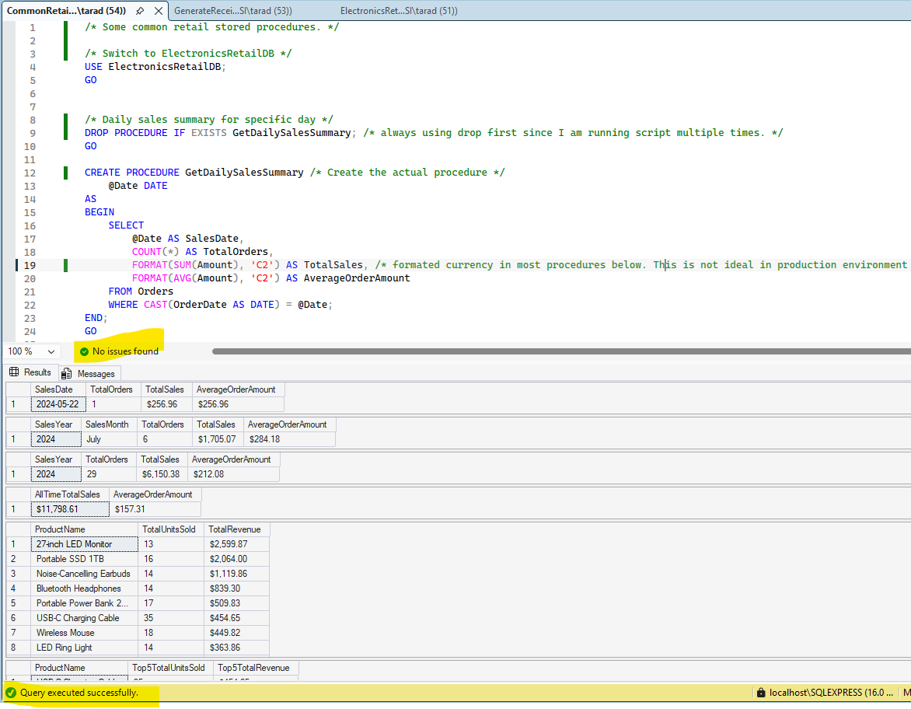
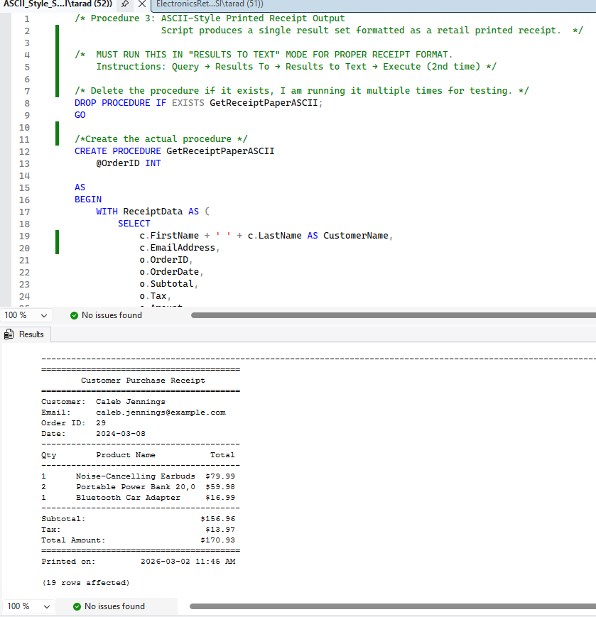

# MySQL Electronics Retail Database (CIS261 Final Project)

A simulated electronics retail database designed in SQL Server Management Studio (SSMS) for CIS261 Final Project, Winter 2026.

## 🧠 Project Overview

To build a database system that generates a simple receipt including:
- Client name
- List of products with prices
- Total amount due

This project demonstrates relational database design, normalization, and stored procedure logic in a retail context.

## 📋 Assignment Steps

| Step | Description |
|------|-------------|
| 1 | Create the database in SSMS |
| 2 | Generate tables for Customers, Orders, OrderItems, and Products |
| 3 | Link tables using primary and foreign keys |
| 4 | Insert data for at least 12 products |
| 5 | Generate a receipt |

## 🧩 Schema Design

- **Customers**: Stores customer details
- **Orders**: Tracks transactions
- **OrderItems**: Line items per order
- **Products**: Product description and pricing

Relationships are enforced using primary and foreign keys.

## 🛠️ Stored Procedures

Three receipt formats were implemented:

1. **Traditional Join Output**  
   - One row per product purchased  
   - Standard relational format

2. **Readable Receipt Format**  
   - Multiple SELECTs for customer info, product list, and totals  
   - Easier to interpret

3. **ASCII-Style Receipt**  
   - Text-mode output resembling a printed receipt  
   - Requires SSMS “Results to Text” mode

Additional common retail procedures (e.g., product lookup, order summary) were included to exceed project expectations.

## 📁 File Structure

| File | Description |
|------|-------------|
| `ElectronicsRetailDB.sql` | Full schema creation script |
| `CommonRetail_StoredProcedures.sql` | Additional stored procedures |
| `GenerateReceipt_StoredProcedure.sql` | Receipt generation logic |
| `ASCII_Style_StoredProcedure.sql` | Receipt generation logic |
| `screenshots/` | Visuals of schema, output, and receipt formatting |

## 🖼️ Screenshots

Stored in the `screenshots` folder:

- 
- 
- 
- 

## 📚 Academic Context

Created for **CIS261: SQL Programming I**  
Pierce College, Winter 2026

## 🚀 How to Run

1. **Open SQL Server Management Studio (SSMS)**  

2. **Execute the `.sql` scripts in order:**

   - `ElectronicsRetailDB.sql`  
     Creates the database schema with four tables: `Customers`, `Orders`, `OrderItems`, and `Products`.  
     Includes sample data for products.

   - `CommonRetail_StoredProcedures.sql`  
     Adds extra stored procedures for retail operations (e.g., product lookup, order summary).  
     These go beyond the assignment requirements to showcase practical enhancements.

   - `GenerateReceipt_StoredProcedure.sql`  
     Creates two receipt formats:  
     - **Traditional Join Output**: One row per product purchased  
     - **Readable Receipt Format**: Multi-section output with customer info, product list, and totals

   - `ASCII_Style_StoredProcedure.sql`  
     Generates a receipt that visually resembles a printed paper receipt.  
     Best viewed in SSMS “Results to Text” mode for proper formatting.
---
